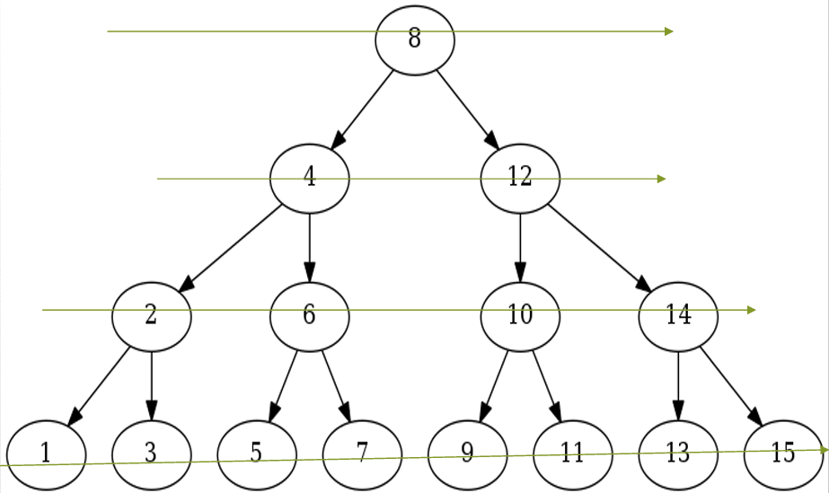

## BREADTH FIRST SEARCH 
### Title Slide
 * Title: Exploring Breadth First Search
 * Subtitle: An Introduction to BFS Algorithm
 * Visual: Illustration of a graph/tree with nodes and edges.

### Overview of BFS
 * Title: What is Breadth First Search?
 * Content:
 * Brief explanation of BFS algorithm.
 * Purpose: To systematically explore a graph or 
 * How it works: Explore all neighbors of a node before moving to the next level.
 * Visual: Diagram illustrating BFS traversal on a graph.

###  BFS Steps (1/2)
 * Title: Steps of Breadth First Search
 * Content:
 * Step 1: Start with a node (usually the root node).
 * Step 2: Explore all neighbors of the current node.
 * Step 3: Enqueue unvisited neighbors into a queue.
 * Visual: Sequential illustration of BFS steps with nodes and queues

 
 
 ### BFS Steps (2/2)
 * Step 4: Dequeue the current node and repeat steps 2 and 3 for its unvisited neighbors.
 * Step 5: Mark visited nodes to avoid revisiting.
 * Step 6: Continue until the queue is empty.

 ### Example Of BFS
 * Title: Example of Breadth First Search
 *  Content:
 *  Present a simple graph with nodes and edges.
 *  Demonstrate BFS traversal using the graph.
 *  Show the order of nodes visited during traversal.
 * Visual: Graph illustration with BFS traversal path highlighted.

 ### Applications of BFS
 * Title: Applications of Breadth First Search
 * Content:
 * Discuss various real-world applications of BFS:
 * Shortest path finding.
 * Network analysis.
 * Web crawling.
 * Social network analysis.
 * Visual: Icons or images representing different applications of BFS.

 ### Advantages of BFS
 * BFS will never get trapped exploring the useful path forever.
 * If there is a solution, BFS will definitely find it.
 * If there is more than one solution then BFS can find the minimal one that requires less number of steps.
 * Low storage requirement – linear with depth.
 * Easily programmable.

 ### Limitations of BFS
 * High Memory Usage:BFS needs to keep track of all explored and unexplored nodes,potentially leading to high memory consumption especially in large graphs.
 * Slow for Deep Solutions:BFS explores all nodes at each level before moving to the next, making it slow for finding solutions deeper in the search space.
 * Sub-optimal Solutions:BFS prioritizes finding any solution quickly not necessarily the shortest or most optimal one.
 * Limited Backtracking: BFS doesn't backtrack easily, making it difficult to explore alternative paths if the initial exploration doesn't lead to the desired outcome.This can be an issue for problems requiring flexible search strategies.

 > By- _Ajay Pratap_