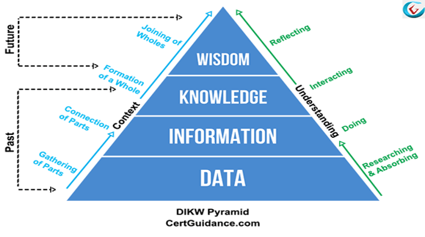
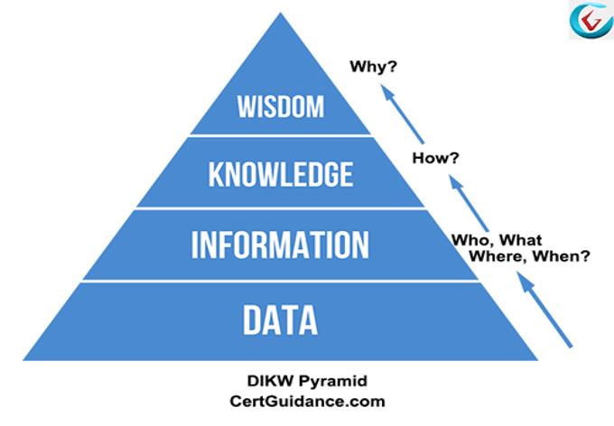

# KNOWLEDGE PYRAMID IN AI
## About Knowledge Pyramid
> We will discuss the DIKW Model of ITIL (Data Information, Knowledge, and Wisdom Model). This model is also known as the DIKW Hierarchy or DIKW Pyramid. In this tutorial, you will learn what is a DIKW Model? How the data is transformed into wisdom And what are the usage and limitations of DIKW Hierarchy?

> We know that, when we collect raw data, it comes in a jumbled form. DIKW Model describes how the data can be processed and transformed into information knowledge, and wisdom.The full form of DIKW Hierarchy is as below:
“D” = Data
“I” = Information
“K” = Knowledge
“W” = Wisdom
The DIKW model of transforming data into wisdom can be viewed from two different angles: contextual and understanding.As per the contextual concept, one moves from a phase of gathering data parts (data) the connection of raw data parts (information) formation of whole meaningful contents (knowledge) and conceptualize and joining those whole meaningful contents (wisdom).From the understanding perspective, the DIKW Pyramid can also be seen as a process starting with researching & absorbing, doing, interacting, and reflecting.

The DIKW hierarchy can also be represented in terms of time. For instance, the data, information, and knowledge levels can be seen as the past while the final step - wisdom - represents the future.Refer to the following diagram to understand the representation:
> The "Data" of DIKW Hierarchy: 
  

## The "Data" of DIKW Hierarchy: 
> The first step in this DIKW model is Data Collection of raw Data is the primary requirement for reaching a meaningful result in the end. Any measurements, logging, tracking, records etc are all considered as data. Since the raw data is collected in bulk, it includes various things both useful and not so useful contents. These are completely raw Data and do not provide any meaningful result that can be used by the IT Service provider. Therefore the data doesn't answer any questions nor draw any conclusion.

## The "Information" of DIKW Pyramid: 
> Pyramid: Information can be termed as the data that has been given a meaning by defining relational connections. Here, the word "meaning" represents processed and understandable data that may or may not be a useful piece of content from the organization perspective. In information processing system, a relational database creates information from the data stored within it. The information hierarchy stage of DIKW Pyramid reveals the relationships in the data, and then the analysis is carried out to find the answer to Who, What, When and Where questions.

## This is the output we can get from information stage

## The "Knowledge" of DIKW Model:
> Knowledge is the third level of DIKW Model. Knowledge means the appropriate collection of information that can make it be useful. Knowledge stage of DIKW hierarchy is a deterministic process. When someone "memorizes" information due to its usefulness, then it can be said that they have accumulated knowledge. Every piece of knowledge itself has useful meanings, but it can't generate further knowledge on its own. In information management system, most of the applications you use, such as modelling, simulation etc, exercise some sort of stored knowledge. The knowledge step tries to find the answer to the "How" question.

## The “Wisdom” of DIKW Hierarchy:
> The Wisdom is the fourth and the last step of the DIKW Hierarchy. It is a process to get the final result by calculating through extrapolation of knowledge. It considers the output from all the previous levels of DIKW Model and processes them through special types of human programming (such as the moral, ethical codes, etc.). Therefore, Wisdom can be thought as the process by which you can take a decision between the right and wrong, good and bad, or any improvement decisions. Alternatively, we can say that in wisdom stage, the knowledge found in the previous stage is applied and implemented in practical life. Wisdom is the topmost level in the DIKW pyramid and answers the questions related to "Why".

> ### Conculsion:
>> Knowledge pyramid help to make your work complete and impressive. 

> By - _Priyanka Kumari_