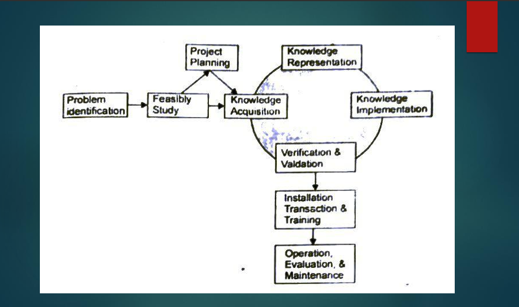
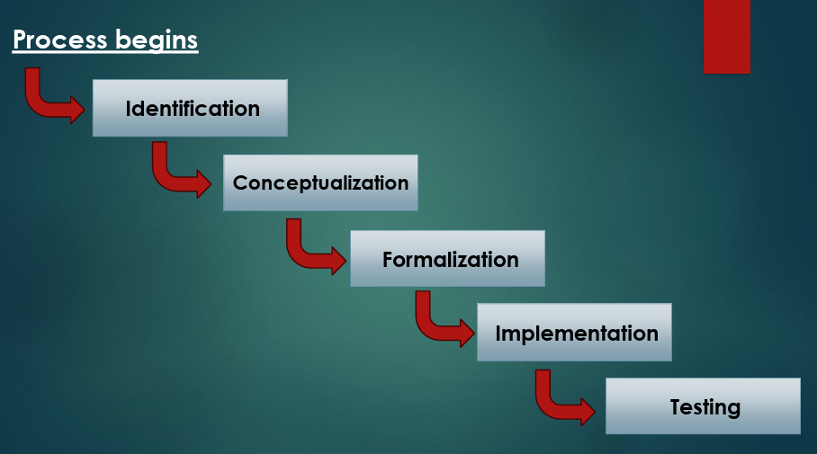

## Expert System:
> An Expert System is AI software that use to store knowledge to solve problems. It is designed to provide intelligent solutions to a problem the knowledge and reasoning processes of human experts. Expert systems typically consist of a knowledge base, an inference engine, and a user interface.
### Example:

## Life Cycle of Expert System
 * Problem Identification 
 * Feasibility Study (Possibility)
 * Project Planning
 * Knowledge Representation
 * Verification & Validation
 * Installation & Training
 * Operation / Evolution / Maintenance
 1. Problem Identification: 
 > Identifying the problem and opportunity where the organization can obtain benefits from expert system, and establishing the expert system general goals.
 2. Feasibility Study:
 > Assessing the feasibility the expert system development in terms of its techniques operational and economic feasibility.
 3. Project Planning:
 > Planning for the expert system project, include development team members working environment, project schedule, and budget.
 4. Knowledge Representation:
 > Representing key concept from domain and inter relationships between these concept using formal representation methods.
 5. Knowledge Implementation:
 >  Coding the formalization knowledge in to a working prototype.
 6. Verification & Validation:
 > Verifying & validation working prototype against the system requirements, and revising it necessary according to domain expert's feedback.
 7. Installation & Training:
 > Installing the final prototype in an operating environment, training the users and developing documentation and user manual.
 8. Operation / Evolution / Maintenance:
 > Running the system in an operating environment, evaluation its performance and benefits and maintaining system.

 

## Stage of Development an Expert System In Artificial Intelligence
#### The Expert System Development has five stages:
 * Problem Identification
 * Formalization (Designing)
 * Implementation
 * Testing.
 * Conceptualization (Decision about development)
 1. Problem Identification:
    * Identify the specific problem or task that the expert system will address.
    * Understand the requirements and constraints of the problem.
 2. Conceptualization:
    * Develop a conceptual plan for how the expert system will solve the identified problem.
    * Define the scope and objectives of the system.
 3. Formalization:
    * Formalize the knowledge acquired from domain experts into a format suitable for computer processing.
    * Represent the knowledge using appropriate techniques, such as rules, frames, or ontologies.
 4. Implementation:
    * Develop and implement the expert system based on the formalized knowledge and conceptual plan.
    * Build the inference engine and integrate it with the knowledge base.
 5. Testing:
    * Test the implemented expert system to ensure that it functions correctly and meets the requirements.
    * Verify that the system produces accurate results and behaves as expected in various scenarios.

    