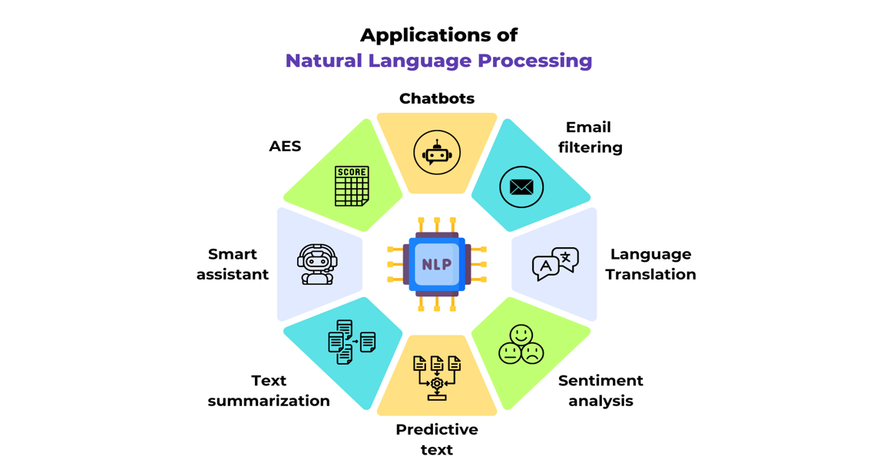

## Natural Language Processing (NLP)
> In the context of computer science and artificial intelligence, NLP most commonly stands for Natural Language Processing. NLP is a field of study that focuses on the interaction between computers and humans using natural language. It involves the development of algorithms and models that enable computers to understand, interpret, and generate human language. Applications of NLP include language translation, sentiment analysis, chatbots, and speech recognition.
 
 

 ## Applications of NLP
    - Language Translation
    - Speech Recognition
    - Text Summarization
    - Analysis
    - AES
    - Email Filters

## Components of NLP
> Natural language processing (NLP) involves various components that work together to process and understand human language. Some of the key components of NLP include:
- Tokenization.
- Part-of-speech tagging.
- Named entity recognition.
- Syntax analysis.
- Semantic analysis.
- Sentiment analysis.
- Machine translation. 
- Information extraction.
- Text generation.
- Language modeling.

#### 1. Tokenization:
> Breaking down text into smaller units such as words or sentences.
#### 2. Part-of-speech tagging: 
Identifying the grammatical parts of speech (e.g., nouns, verbs, adjectives) in a sentence.
#### 3. Named entity recognition: 
Identifying and classifying named entities (e.g., names of people, organizations, locations) in text.
#### 4. Syntax analysis: 
Analyzing the grammatical structure of sentences to understand relationships between words.
#### 5. Semantic analysis: 
Understanding the meaning of text by analyzing the context and relationships between words.
#### 6. Sentiment analysis:
Determining the sentiment or emotion expressed in text, such as positive, negative, or neutral.
#### 7. Machine translation: 
Translating text from one language to another using machine learning algorithms.
#### 8. Information extraction: 
Identifying and extracting relevant information from text, such as dates, locations, or events.
#### 9. Text generation: 
Generating human-like text based on input data or predefined rules.
#### 10. Language modeling: 
Building statistical models to predict and generate text based on patterns in language data.

> By- _Khushi Singhal_  